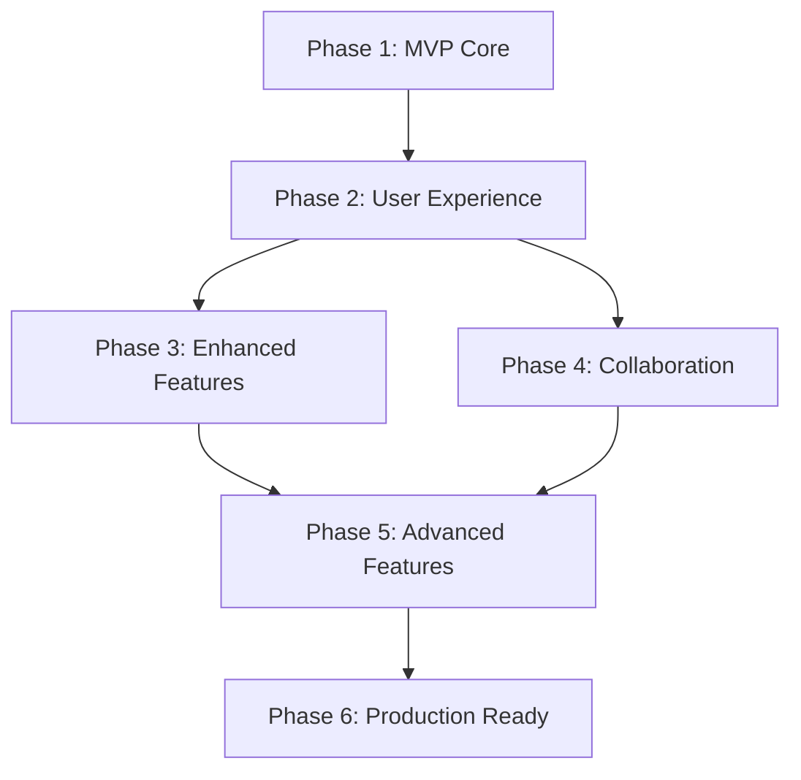

# Phase Breakdown: 6 Development Phases

Based on the feature requirements and complexity analysis, the Trello Mini application will be implemented in **6 distinct phases**:

---

## 📊 Phase Overview

| Phase | Duration | Focus Area | Key Features | Complexity |
|-------|----------|------------|--------------|------------|
| **Phase 1** | 2-3 weeks | MVP Core | Basic CRUD, UI Foundation | ⭐⭐ |
| **Phase 2** | 2-3 weeks | User Experience | Drag & Drop, Authentication | ⭐⭐⭐ |
| **Phase 3** | 3-4 weeks | Enhanced Features | Rich Cards, Labels, Comments | ⭐⭐⭐⭐ |
| **Phase 4** | 4-5 weeks | Collaboration | Real-time, Multi-user, Notifications | ⭐⭐⭐⭐⭐ |
| **Phase 5** | 3-4 weeks | Advanced Features | Analytics, Search, Templates | ⭐⭐⭐⭐ |
| **Phase 6** | 2-3 weeks | Production Ready | Performance, Security, Deployment | ⭐⭐⭐ |

**Total Estimated Timeline: 16-22 weeks (4-5.5 months)**

---

## 🚀 Phase 1: MVP Core (Weeks 1-3)

### Objectives
- ✅ Complete basic backend API (DONE)
- 🔧 Build functional frontend UI
- 🔧 Implement core CRUD operations
- 🔧 Basic responsive design

### Features Delivered
- [x] ✅ Boards (create, view, delete)
- [x] ✅ Lists/Columns (To Do, In Progress, Done)
- [x] ✅ Cards (basic tasks management)
- [ ] 🔧 Basic UI with Angular Material
- [ ] 🔧 Responsive layout
- [ ] 🔧 Error handling

### Success Criteria
- [ ] Users can create and manage boards
- [ ] Lists and cards work with full CRUD
- [ ] UI is mobile-friendly
- [ ] No critical bugs in core functionality

---

## 🎯 Phase 2: User Experience (Weeks 4-6)

### Objectives
- 🔧 Add drag & drop functionality
- 🔧 Implement user authentication
- 🔧 Polish UI/UX design
- 🔧 Add form validation

### Features Delivered
- [ ] 🔧 Drag & drop cards between lists
- [ ] 🔧 User registration and login
- [ ] 🔧 JWT authentication
- [ ] 🔧 Protected routes
- [ ] 🔧 Form validation and error handling
- [ ] 🔧 Loading states and feedback

### Success Criteria
- [ ] Smooth drag & drop experience
- [ ] Secure user authentication
- [ ] Intuitive user interface
- [ ] Proper error handling and validation

---

## 🌟 Phase 3: Enhanced Features (Weeks 7-10)

### Objectives
- 🔧 Rich card functionality
- 🔧 Labels and tagging system
- 🔧 Comments and activity tracking
- 🔧 File attachments

### Features Delivered
- [ ] ⭐ Card details (description, checklist, due date)
- [ ] 🏷️ Labels/Tags with colors
- [ ] 💬 Comments system
- [ ] 📎 File attachments
- [ ] 📊 Activity timeline
- [ ] 🔍 Basic search and filtering

### Success Criteria
- [ ] Cards have rich functionality
- [ ] Labels enhance organization
- [ ] Comments enable communication
- [ ] File sharing works reliably

---

## 🤝 Phase 4: Collaboration (Weeks 11-15)

### Objectives
- 🔧 Real-time updates with SignalR
- 🔧 Multi-user board collaboration
- 🔧 Advanced notifications
- 🔧 Team management

### Features Delivered
- [ ] 🔄 Real-time updates (SignalR)
- [ ] 👥 Board members/collaboration
- [ ] 🔔 Notification system
- [ ] 👤 User profiles and avatars
- [ ] 🔐 Role-based permissions
- [ ] 📧 Email notifications

### Success Criteria
- [ ] Real-time collaboration without conflicts
- [ ] Effective team collaboration features
- [ ] Reliable notification system
- [ ] Proper permission management

---

## 📈 Phase 5: Advanced Features (Weeks 16-19)

### Objectives
- 🔧 Analytics and reporting
- 🔧 Advanced search capabilities
- 🔧 Board templates
- 🔧 Productivity enhancements

### Features Delivered
- [ ] 📊 Analytics dashboard
- [ ] 🔍 Advanced search and filtering
- [ ] 🏗️ Board templates
- [ ] 📈 Progress tracking
- [ ] 📊 Export functionality
- [ ] 🤖 Basic automation rules

### Success Criteria
- [ ] Analytics provide valuable insights
- [ ] Search is fast and comprehensive
- [ ] Templates accelerate board creation
- [ ] Features improve productivity

---

## 🚢 Phase 6: Production Ready (Weeks 20-22)

### Objectives
- 🔧 Performance optimization
- 🔧 Security hardening
- 🔧 Production deployment
- 🔧 Monitoring and maintenance

### Features Delivered
- [ ] ⚡ Performance optimization
- [ ] 🔒 Security audit and fixes
- [ ] 🐳 Docker containerization
- [ ] ☁️ Cloud deployment (Azure/AWS)
- [ ] 📊 Monitoring and logging
- [ ] 📚 Complete documentation

### Success Criteria
- [ ] Application loads in under 3 seconds
- [ ] Security vulnerabilities addressed
- [ ] Scalable deployment architecture
- [ ] Comprehensive monitoring in place

---

## 🎯 Current Status (Phase 1 Progress)

### ✅ Completed (Week 1)
- [x] .NET Core Web API project structure
- [x] Angular TypeScript frontend project
- [x] Database models (Board, List, Card) with Entity Framework
- [x] Entity Framework configuration
- [x] API controllers for Boards, Lists, and Cards
- [x] CORS configuration
- [x] Angular services for API communication
- [x] TypeScript interfaces and models

### 🔧 In Progress (Week 1-2)
- [ ] Angular components implementation
- [ ] Frontend UI with Angular Material
- [ ] Board list display and management
- [ ] Card and list components
- [ ] Basic routing and navigation

### 📋 Upcoming (Week 2-3)
- [ ] Form validation and error handling
- [ ] Responsive design implementation
- [ ] Testing and bug fixes
- [ ] Phase 1 completion and review

---

## 📊 Phase Dependencies

### Critical Dependencies
- **Phase 2** requires **Phase 1** completion (stable foundation)
- **Phase 4** requires **Phase 2** (authentication for multi-user)
- **Phase 5** depends on **Phases 3 & 4** (rich features + collaboration)
- **Phase 6** requires all previous phases (complete feature set)

---

## 🎯 Resource Allocation

### Development Team Recommendations
- **Phase 1-2**: 1-2 Full-stack developers
- **Phase 3-4**: 2-3 developers (Frontend, Backend, DevOps)
- **Phase 5-6**: 2-4 developers (specialized roles)

### Skill Requirements by Phase
- **Phase 1**: .NET Core, Angular, TypeScript
- **Phase 2**: Angular CDK, JWT, UX Design
- **Phase 3**: UI/UX, Database design
- **Phase 4**: SignalR, Real-time systems
- **Phase 5**: Analytics, Search systems
- **Phase 6**: DevOps, Cloud deployment

---

## 🏆 Success Metrics by Phase

### Phase 1: Foundation
- [ ] All CRUD operations working
- [ ] Basic UI implemented
- [ ] No critical bugs

### Phase 2: Usability
- [ ] Drag & drop works smoothly
- [ ] Authentication is secure
- [ ] UI is intuitive

### Phase 3: Features
- [ ] Rich card features adopted by 70% of users
- [ ] Comments used regularly
- [ ] Labels improve organization

### Phase 4: Collaboration
- [ ] Multi-user boards active
- [ ] Real-time updates seamless
- [ ] Team features enhance productivity

### Phase 5: Advanced
- [ ] Analytics provide insights
- [ ] Advanced features increase engagement
- [ ] Templates accelerate workflows

### Phase 6: Production
- [ ] Performance meets targets
- [ ] Security audit passed
- [ ] Deployment is reliable

This phased approach ensures steady progress, manageable complexity, and the ability to deliver value early while building toward a comprehensive solution.